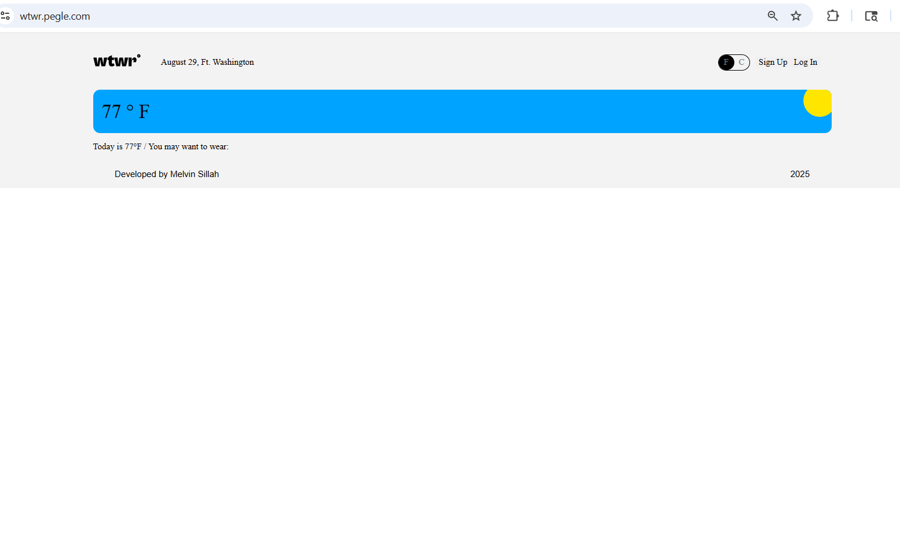
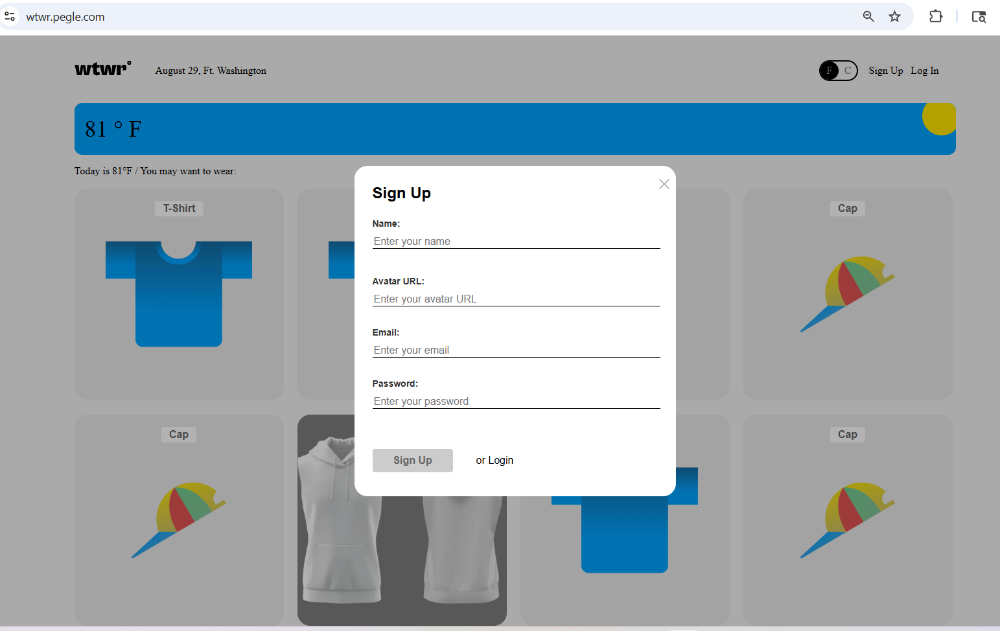
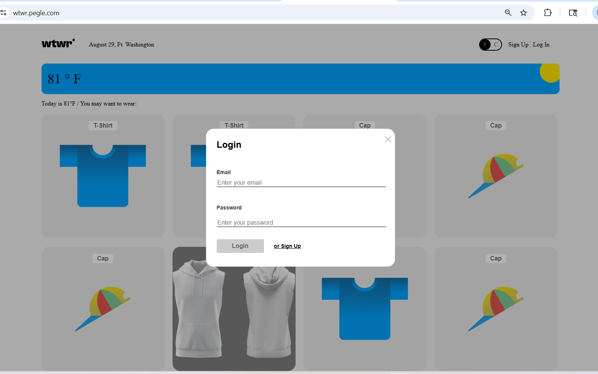
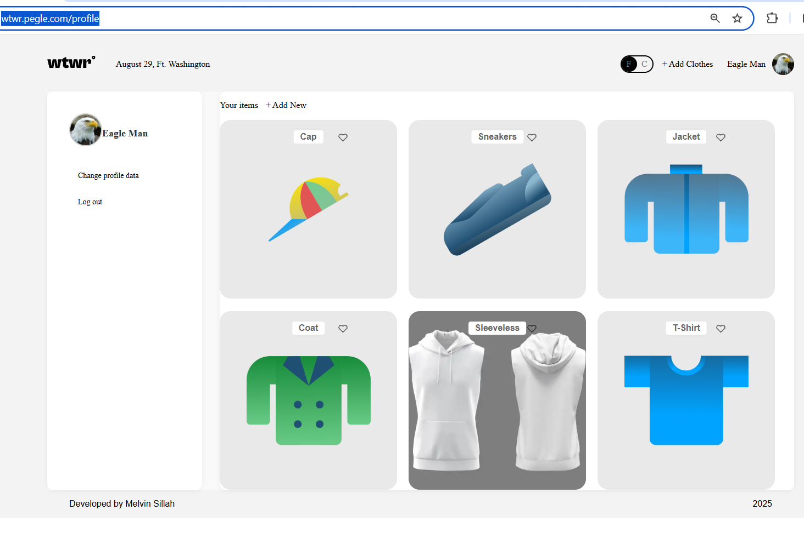
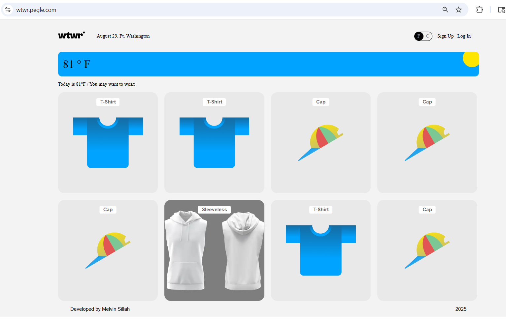
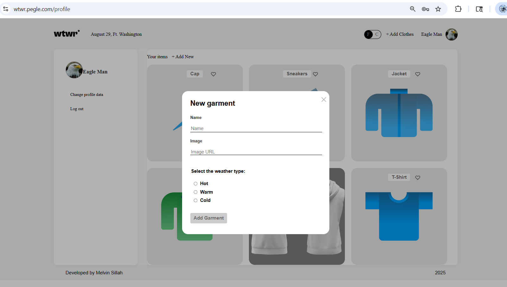

# WTWR (What to Wear?) – Backend

## Project Description

This is the backend for the WTWR (What to Wear?) application, a full-stack project that helps users decide what to wear based on the weather.

## The backend handles:

- User authentication & authorization (JWT-based).
- User profiles (sign up, sign in, update profile).
- Clothing items management (create, read, like, dislike, delete).
- Secure API requests with validation and error handling.
  The project is fully deployed with custom domains and SSL.

## Technologies & Techniques Used

- Node.js & Express.js – Backend framework.
- MongoDB & Mongoose – Database & schemas.
- CORS – Configured for secure cross-origin requests.
- Celebrate/Joi/Validator – Input validation.
- Winston – Request & error logging.
- PM2 – Process manager for deployment.
- Nginx – Reverse proxy & SSL termination.
- dotenv – Secure environment variable management.
- ES6 – Used wherever possible.
- Prettier – For consistent code formatting.

## Screenshots & Features

Screenshots of the project in action (frontend + backend interaction):

### home page

### Signup Page

### login Page

### Profile Page

### Clothing List

### Add Item Modal

## Deployed Server Links

- Frontend: https://wtwr.pegle.com
- Frontend (www): https://www.wtwr.pegle.com
- Backend API: https://api.wtwr.pegle.com

## Highlights:

- ES6 features used throughout the codebase.
- CORS configured correctly.
- Code consistently formatted with Prettier.
- Fully deployed & production-ready.
